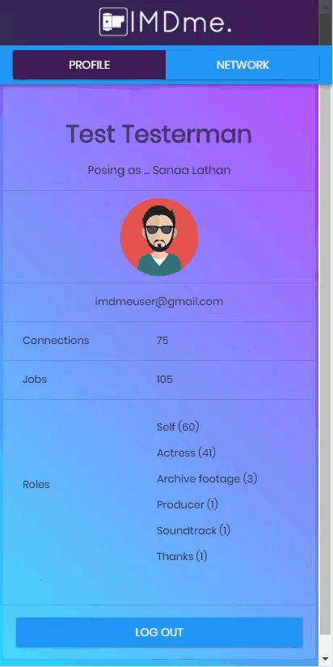

# IMDme

[IMDme](https://imdme-app.herokuapp.com/) is a network visualization application for professionals in the film and television industries that scrapes a user's filmography from his or her IMDB profile. The app then displays summary statistics of the user's professional experience and his or her network as an interactive visualization.

**IMDme** uses the following packages:
* **[express](https://expressjs.com/)**: minimal and flexible Node.js web application framework
* **[body-parser](https://www.npmjs.com/package/body-parser)**: intercepts requests with the X-JSON-Body: field header and replaces req.body with the parsed contents of req.body.field
* **[scrape-it](https://www.npmjs.com/package/scrape-it)**: allows scraping data from websites
* **[sequelize](https://www.npmjs.com/package/sequelize)**: promise-based Node.js ORM for Postgres, MySQL, SQLite and Microsoft SQL Server

## Functionality

Upon initial load, the user is prompted to log-in using **[Google OAuth2](https://developers.google.com/identity/protocols/OAuth2)** and enter a link to a user's IMDB website. If a user has previously logged in and associated his or her Google account with an IMDB account, the user is not prompted to enter a new IMDB link.

Scrape-it pulls a user's job history including the project name, his or her role on the project, and the link to the project's IMDB website. The data is loaded into a series of MySQL database tables using Sequelize.

Upon completion, a user's profile is displayed, including the Google username, IMDB username (if posing as another user), Google profile image, Google email address, total number of IMDme connections, total number of jobs, and a list of the user's roles with a count of jobs credited to each role.

Clicking on "Network" on the navigation bar presents a user's network as an interactive visualization. Each node represents a person in the user's professional network, and the links between them represent shared jobs. The color of the node corresponds with the node-user's most frequent role. The list of roles is provided as a legend. This [force-directed graph](https://bl.ocks.org/mbostock/4062045) is produced with D3.js, and each node can be dragged to view the network from a variety of perspectives. Desktop users can hover over a node to reveal the name of the node.

## Future Development

* Assemble real-time network using recurive web scraping
* Display feed of activity for connections
* Find shortest distance between two users
* Compare network expansion of potential job opportunities
